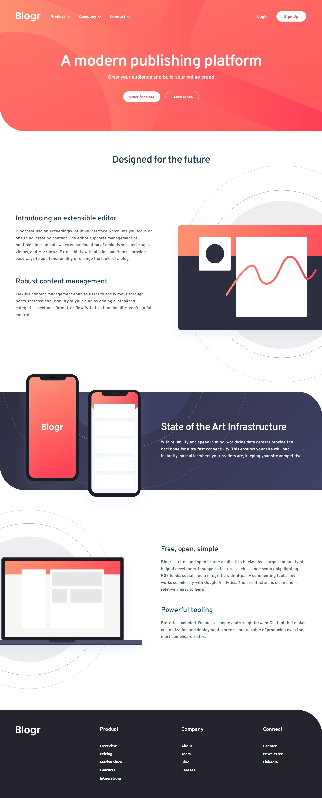

# Frontend Mentor - Blogr landing page

  

This is a solution to the [Blogr landing page challenge on Frontend Mentor](). Frontend Mentor challenges help us to improve our coding skills by building realistic projects.   

## Built with

- Semantic HTML5 markup
- SCSS
- Flexbox
- Javascript
- Mobile-first workflow

Preview it here - [Blogr landing page]()   

## Author

- Website - [Black Fury](https://blackfury117.github.io/)
- Frontend Mentor - [@BlackFury117](https://www.frontendmentor.io/profile/BlackFury117)
- Twitter - [@blackfury117](https://www.twitter.com/blackfury117)